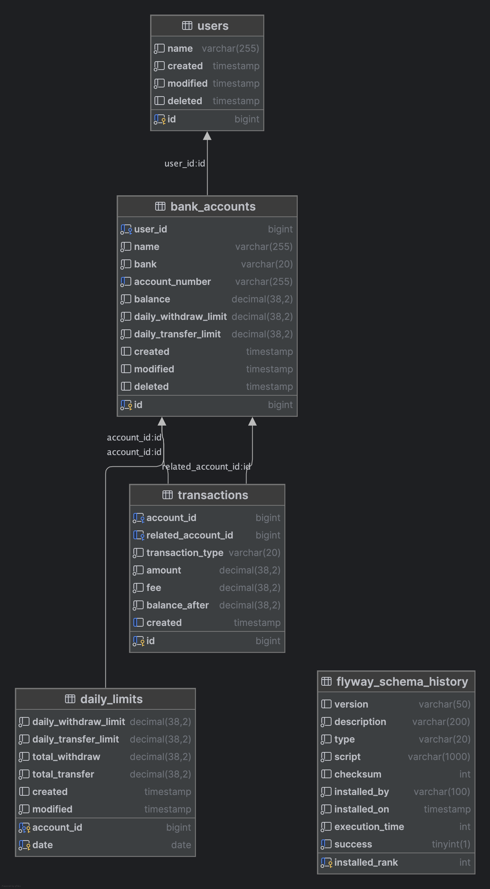

# 계좌 송금 서비스

## Requirements

----

|                | Main version |
|----------------|--------------|
| Java           | ^21          |
| Docker         | ^23.0.5      |
| Docker-Compose | ^2.17.3      |

## Getting Started

----

**서버 실행**
```bash
# 프로젝트 빌드
./gradlew :subproject:boot:build

# MySQL container 설치 / 실행
docker-compose up -d
```

DB는 요구사항대로 MySQL 8 버전이며, 마이그레이션 후 아래 샘플 상품 데이터 추가, 기본 환경설정으로 DB_USER = root, PASSWORD = password123!, PORT = 3306 로 접근 가능합니다.

## Swagger

----

Docker 를 사용하여 인스턴스 실행 후 http://localhost:8080/swagger-ui/index.html#/ 경로에 접근하여 아래 예시와 같이 swagger 명세를 확인할 수 있습니다.


[Wire Barley.postman_collection.json](public/postman/Wire%20Barley.postman_collection.json) 해당 파일을 Postman 에 import 하여 여러 동작들을 자유롭게 테스트 해보실 수 있습니다.

아래와 같은 기능들을 구현하였으며, ``계좌 등록`` API 를 호출하여 계좌 생성 후 나머지 기능들을 테스트 해보실 수 있습니다. ``계좌를 삭제할 경우`` 해당 계좌를 사용할 수 없으니 삭제 하였을 경우 추가로 계좌 생성을 하여야 합니다.

일 출금 / 이체 한도를 넘기는 경우 에러가 발생하며 여러 파라미터 값을 바꾸어 아래 기능들을 테스트 가능합니다.

**초기 DB 실행 시 2명의 유저(1번, 2번) 가 자동으로 생성되도록 해두었기 때문에 사용자는 추가로 생성하지 않으셔도 됩니다!**

### 1. 계좌 등록하기 / 삭제하기 API

- 새로운 계좌를 등록하거나 기존 계좌를 삭제할 수 있는 API를 구현하세요.

### 2. 입금, 출금 및 이체 API

### 입금 API

- 특정 계좌에 금액을 입금하는 기능을 구현하세요.

### 출금 API

- 특정 계좌에서 금액을 출금하는 기능을 구현하세요.
- **한도 체크**
    - 일 한도: 1일 최대 1,000,000원

### 이체 API

- 출금 계좌에서 다른 계좌로 금액을 이체하는 기능을 구현하세요.
- **수수료 계산**: 이체 금액의 1%를 수수료로 부과합니다.
- **한도 체크**
    - 일 한도: 1일 최대 3,000,000원

### 3. 거래내역 조회하기 API

- 지정된 계좌의 송금 및 수취 내역을 조회할 수 있는 API를 구현하세요.
    - 내역은 최신순으로 정렬하여 반환합니다.

## Structure

----

Layered Architecture 개념대로 각 레이어를 멀티 모듈 구조로 나누어 presentation / domain / application / infrastructure 로 나누었으며 해당 프로젝트를 실행 시키는 boot 모듈이 있습니다.<br/>

- presentation - 클라이언트 요청을 받아 인증 / 권한검사 / 요청에 대한 응답 을 수행
- domain - 도메인 객체의 구조 및 동작을 정의
- application - 트랜잭션 / domain 및 infrastructure 레이어를 직 / 간접적으로 호출하여 비즈니스 로직의 흐름을 오케스트레이션
- infrastructure - DB access / 외부 API 호출 등 outbound 통신을 수행

``application 레이어``에서 비즈니스 로직 흐름을 관리하는 파일 단위를 Service 객체로 표현하지 않고 아래 예시와 같이 각 동작별로 클래스를 정의하여 ``presentation 레이어``에서 각각 호출하는 개념으로 정의하였습니다.
각 클래스의 ``invoke`` 메서드를 호출하는 구조입니다. 보통 사용되는 Service 단위로 정의하지 않은 이유는 서비스 규모가 커질수록 해당 구조가 기능과 관련된 동작만 빠르게 파악할 수 있다보니 파악하기 수월하고 변경점에 강하다고 생각되기 때문입니다.

```java
@Service
@RequiredArgsConstructor
public class DepositBankAccount {

    private final BankAccountRepository bankAccountRepository;
    private final SaveTransaction saveTransaction;

    @Transactional
    public BankAccount invoke(long id, BigDecimal amount) throws NotFoundException {
        var found = bankAccountRepository.findById(id).orElseThrow(
            () -> new NotFoundException(String.format("Bank account was not found by id(%d)", id))
        );

        var updated = bankAccountRepository.save(found.deposit(amount));

        saveTransaction.invoke(id, id, amount, updated.balance(), TransactionType.DEPOSIT);

        return updated;
    }
}
```

## Test

----

```bash
./gradlew test
```
[Application 레이어의 테스트](subproject/application/src/test/java/io/dflowers/remittanceservice) 환경만 Infrastructure 레이어를 참조하고 Testcontainers, Flyway 를 활용하여<br/>
테스트 환경에서 동일하게 DB 및 Table 을 구성한 후 통합 테스트를 수행하도록 구성하였습니다.<br/>

Application layer 에서 통합 테스트를 진행하다 보니 return value(반환값) 에 대한 검증뿐만 아니라 동작 수행 후 쿼리를 실행하여 아래 예시와 같이 return value 에 포함되지 않는 여러 검증도 할 수 있는 장점이 있습니다.

```java
@Test
public void testShouldReturnCorrectlyTransactionDataOfReceiver()
    throws NotFoundException, BadRequestException {
    var amount = new BigDecimal(5000);

    transferBankAccount.invoke(sender.id(), receiver.id(), amount);

    var transaction = transactionRepository
        .findByAccountId(receiver.id(), 0)
        .stream().filter(
            (t) -> t.transactionType() == TransactionType.RECEIVED
        )
        .toList()
        .getFirst();
    var afterReceiver = bankAccountRepository.findById(receiver.id()).get();

    assertEquals(transaction.balanceAfter().compareTo(receiver.balance().add(amount)), 0);
    assertEquals(transaction.balanceAfter().compareTo(afterReceiver.balance()), 0);
    assertEquals(transaction.amount().compareTo(amount), 0);
}
```

여러 요청 유형에 대하여 발생할 수 있는 상황들을 검증 하였으며, test / testFixtures 를 분리하여 테스트 코드는 테스트에 집중할 수 있도록 하였습니다.

## DB

----


- users - 고객 정보
- bank_accounts - 계좌 정보
- transactions - 출금 / 입금 / 송금 등의 거래내역 정보
- daily_limits - 일별 한도관리 정보

거래내역 조회를 위해 아래와 같은 복합 인덱스를 정의하여 계좌 ID 단위로 거래내역 생성 역순으로 쿼리 최적화가 수행될 수 있도록 하였습니다.

```sql
CREATE INDEX transactions_account_id_id_desc_index
    ON transactions (account_id, id desc);
```